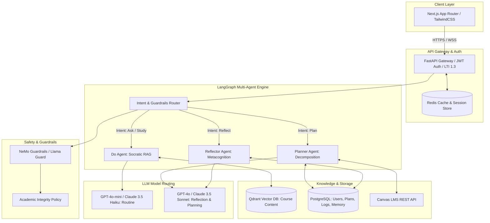

# PRODUCT REQUIREMENTS DOCUMENT (PRD)
## Trợ Lý Học Tập Cá Nhân AI: Chu Trình Plan - Do - Reflect
**Mã dự án:** EDU-01 | **Repository:** `VinUni_T008` | **Trạng thái:** Active Development

---

## 1. Tổng quan sản phẩm (Product Overview)

### 1.1 Tầm nhìn (Vision)
Xây dựng một "AI Learning Companion" thông minh, thấu hiểu và cá nhân hóa cho từng sinh viên đại học. Hệ thống không chỉ là một công cụ quản lý công việc (To-do list) hay một chatbot hỏi đáp rời rạc, mà là một hệ thống tác nhân đa trí tuệ (Multi-Agent System) khép kín theo chu trình siêu nhận thức: **Lập kế hoạch (Plan) -> Hành động có định hướng (Do) -> Phản tư cải tiến (Reflect)**

### 1.2 Bối cảnh, Thực trạng & Lập luận Căn nguyên (Context & Root-Cause Analysis)
Tại các trường đại học đào tạo theo chuẩn quốc tế (như VinUni), sinh viên học theo tín chỉ và mô hình **Học tập chủ động (Active Learning / PBL)**, trong đó **>65% thời lượng học tập là tự học ngoài giảng đường**. Mọi học liệu và bài tập đều vận hành qua **Canvas LMS**. Tuy nhiên, quá trình tự học thực tế bộc lộ 5 nghịch lý mang tính căn nguyên:

1. **"Hạn chế Canvas: Chỉ có Due Date tĩnh**
   - Canvas LMS chỉ là hệ thống quản trị nội dung và hạn nộp tĩnh (`Due Date`: ví dụ *23:59 Chủ Nhật*). 
   - Hệ thống thiếu hoàn toàn cơ chế **Dựng giàn giáo nhận thức (Cognitive Scaffolding)**: một bài quiz 15 phút và một đồ án 25 giờ được hiển thị ngang hàng trên To-Do List. Không có công cụ ước lượng khối lượng (Workload Estimation), sinh viên bị đánh lừa bởi cảm giác "còn nhiều thời gian", dẫn đến trì hoãn bắt đầu.
2. **Lập kế hoạch thiếu thực tế (Planning Fallacy) -> Trì hoãn**
   - Học 4–6 môn song song với khối lượng assignment dày đặc, sinh viên thiếu kỹ năng phân rã bài tập lớn (Work Breakdown Structure - WBS).
   - Hệ quả: Sinh viên dồn toàn bộ bài tập vào **3–4 tiếng trước giờ đóng cổng Canvas (21:00 – 23:59)**. Tình trạng "chữa cháy" (firefighting) triền miên gây kiệt sức (burnout), chất lượng bài nộp sụt giảm và tỷ lệ nộp muộn (late submissions) cao.
3. **Vòng lặp "Chạy theo bài" & Làm bài đối phó (Cramming 21h-23h59):**
   - Đa số bài tập được giải quyết vào ban đêm hoặc cuối tuần – thời điểm giảng viên và TA không có giờ Office Hours.
   - Khi gặp bế tắc logic lúc 23:00, áp lực deadline cận kề và nỗi sợ điểm liệt đẩy sinh viên vào tâm lý hoảng loạn. Sinh viên tìm đến các công cụ GenAI công cộng (ChatGPT) để copy-paste đề bài và yêu cầu **"giải hộ / viết code hộ"**. Đây là hệ quả trực tiếp của việc thiếu người đồng hành sư phạm 24/7 có ranh giới bảo vệ liêm chính.
4. **Áp lực deadline đêm muộn-> Bế tắc -> Lạm dụng GenAI giải hộ:**
   - Sinh viên chỉ hoạt động ở pha Thực thi (Do), hoàn toàn bỏ qua pha Lập kế hoạch (Plan/Forethought) và Tự phản tư (Self-Reflection).
   - Khi nhận điểm và nhận xét qua Canvas SpeedGrader, sinh viên chỉ nhìn điểm số rồi đóng tab. Nhận xét của giảng viên không được chuyển hóa thành bài học cải tiến, khiến các lỗi sai tiếp tục lặp lại ở assignment tiếp theo.
5. **"Thiếu vòng lặp cải thiện: Nộp xong bỏ quên feedback -> Lặp lại sai lầm:**
   - Canvas Analytics chỉ cung cấp chỉ số trễ (Lagging Indicators): ai đã nộp, ai chưa nộp, điểm trung bình. Giảng viên hoàn toàn không nhìn thấy sinh viên đang mắc kẹt ở khái niệm nào trong 1–2 tuần trước deadline để kịp thời can thiệp (Early Intervention).

---

### 1.3 Nguyên tắc thiết kế (Core Tenets)
1. **Academic Integrity by Design:** Công nghệ AI tồn tại để hỗ trợ phát triển tư duy của sinh viên, không thay thế việc học. Mọi hành vi yêu cầu làm bài tập đều bị chặn và chuyển sang phương pháp hướng dẫn gợi mở.
2. **Grounded & Verifiable:** Mọi kiến thức và gợi ý học tập phải dựa trên tài liệu chính khóa (Syllabus, Slide, Textbook) kèm số trang/slide đối chiếu.
3. **Privacy:** Bảo vệ quyền riêng tư học tập của sinh viên. Mọi dữ liệu phân tích gửi tới giảng viên đều được tổng hợp và ẩn danh.

---

## 2. Phân quyền & Vai trò người dùng (Roles & Permissions)

| Vai trò | Quyền hạn chính |
| :--- | :--- |
| **Sinh viên (Student)** | - Kết nối tài khoản Canvas LMS cá nhân.
- Thiết lập mục tiêu học tập theo tuần/kỳ.
- Tương tác với AI Companion để giải thích bài giảng và phân rã deadline.
- Tham gia các phiên phản tư định kỳ.
- Xem lịch sử học tập và thống kê năng suất cá nhân. |
| **Giảng viên (Instructor)** | - Tải lên tài liệu chính thống (Syllabus, Slides, Rubrics) vào Vector DB của môn học.
- Xem Dashboard tổng quan tiến độ lớp (dữ liệu ẩn danh).
- Theo dõi biểu đồ phân phối điểm nghẽn của môn học.
- Nhận cảnh báo sớm về các nhóm sinh viên có nguy cơ trễ hạn (Early At-Risk Alert). |
| **Quản trị viên (Admin)** | - Quản lý cấu hình tích hợp Canvas LTI 1.3 / API Gateway.
- Theo dõi chi phí token, latency và độ ổn định của hệ thống.
- Quản trị bộ Guardrails liêm chính học thuật và cấu hình Vector DB. |

---

## 3. Đặc tả tính năng chức năng (Functional Specifications)

### 3.1 Giai đoạn PLAN (Lập kế hoạch thông minh)
- **F-PLAN-01: Đồng bộ hóa Canvas LMS (Canvas Sync Engine)**
  - Tích hợp qua Canvas REST API và LTI 1.3.
  - Tự động lấy danh sách môn học (Courses), bài tập (Assignments), thời hạn nộp (Due dates) và tiêu chí chấm (Rubrics).
  - Cung cấp mock dataset chuẩn Canvas cho môi trường kiểm thử không có sandbox trường.
- **F-PLAN-02: Phân rã nhiệm vụ tự động (Task Decomposition Agent)**
  - Phân tích độ phức tạp của bài tập (dựa trên syllabus, rubric và ước lượng số giờ).
  - Tự động chia assignment lớn thành các micro-milestones có hạn chót cụ thể (Ví dụ: Đọc tài liệu ->Lập dàn ý -> Triển khai mã nguồn -> Viết báo cáo -> Review).
- **F-PLAN-03: Thiết lập mục tiêu tuần (Weekly Goal Setting)**
  - Vào đầu mỗi tuần (Thứ Hai 08:00), AI chủ động gợi ý sinh viên chọn 2-3 mục tiêu trọng tâm (Core Focus) kết hợp giữa bài học lý thuyết và deadline nộp bài.

### 3.2 Giai đoạn DO (Hành động & Hỗ trợ học tập có nguồn dẫn)
- **F-DO-01: Grounded RAG Assistant (Qdrant + Cohere/BGE Reranker)**
  - Trả lời thắc mắc học thuật dựa 100% trên slide và giáo trình môn học đã được index trong Qdrant.
  - **Trích nguồn bắt buộc (Mandatory Citation):** Mỗi câu trả lời phải kèm metadata: `[Tên tài liệu, Slide #, Trang #]`.
- **F-DO-02: Academic Integrity Guardrails (Chặn làm hộ bài)**
  - Tích hợp lớp kiểm soát (NeMo Guardrails / Llama Guard).
  - Phát hiện các mẫu câu như: *"Giải giúp tôi bài tập này để nộp"*, *"Viết code hoàn chỉnh cho assignment 2"*, *"Cho đáp án đề trắc nghiệm này"*.
  - **Xử lý:** Từ chối đưa ra lời giải trực tiếp -> Kích hoạt chế độ **Socratic Tutor** (Đưa ra câu hỏi định hướng, giải thích định lý cơ bản, hoặc hướng dẫn giải ví dụ tương tự).
- **F-DO-03: Nhắc việc theo ngữ cảnh (Contextual Nudges)**
  - Đẩy thông báo nhắc nhở thông minh trước deadline dựa trên tiến độ thực tế (không spam báo thức tĩnh, mà nhắc theo trạng thái của micro-milestones).

### 3.3 Giai đoạn REFLECT (Phản tư nhận thức)
- **F-REFLECT-01: Phiên phản tư định kỳ (Cognitive Reflection Session)**
  - Kích hoạt vào cuối tuần (Chủ nhật 18:00) hoặc ngay sau khi sinh viên bấm nộp bài trên Canvas.
  - AI tạo đối thoại ngắn (3–5 câu hỏi):
    1. *Bạn đã hoàn thành bao nhiêu % mục tiêu đề ra đầu tuần?*
    2. *Phần kiến thức/bài tập nào làm bạn mất nhiều thời gian nhất? Vì sao?*
    3. *Phương pháp học trong tuần có điểm nào cần điều chỉnh cho tuần tới?*
- **F-REFLECT-02: Bộ nhớ dài hạn cá nhân (Long-term Personal Memory)**
  - Sử dụng PostgreSQL + pgvector để lưu trữ lịch sử phản tư, phong cách học tập và các chủ đề sinh viên hay gặp khó khăn.
  - AI ở các tuần sau sẽ tham chiếu lại kinh nghiệm quá khứ (Ví dụ: *"Tuần trước bạn gặp khó ở phần Dynamic Programming, tuần này môn Thuật toán có bài tương tự, bạn muốn chia nhỏ thời gian sớm hơn không?"*).
- **F-REFLECT-03: LLM-as-a-Judge Reflection Quality Scorer**
  - Đánh giá chiều sâu của câu trả lời phản tư theo thang điểm Bloom/Metacognitive Depth để khuyến khích sinh viên tự nhận thức sâu sắc hơn.

### 3.4 Phân hệ GIẢNG VIÊN (Instructor Dashboard & HITL)
- **F-INST-01: Thống kê tổng quan lớp học ẩn danh ( Aggregation)**
  - Tỷ lệ sinh viên hoàn thành mục tiêu tuần của lớp.
  - Phân bố thời gian biểu làm bài tập (nộp sớm vs nộp sát nút).
- **F-INST-02: Bản đồ nhiệt khó khăn (Concept Confusion Heatmap)**
  - Thống kê các chủ đề/khái niệm được sinh viên hỏi AI nhiều nhất và hay gặp bế tắc nhất trong tuần.
  - Giúp giảng viên điều chỉnh nội dung bài giảng trên lớp kế tiếp.
- **F-INST-03: Cảnh báo nguy cơ trễ hạn (At-Risk Early Warning)**
  - Thuật toán gắn cờ các trường hợp: 2 tuần liên tiếp không lập kế hoạch, chưa bắt đầu micro-milestone dù deadline còn < 48h.
  - Hiển thị dưới dạng mã số ẩn danh (hoặc cơ chế gửi thông báo khích lệ tự động từ hệ thống thay mặt giảng viên).

---

## 4. Kiến trúc kỹ thuật & Multi-Agent Workflow

---

## 5. Yêu cầu phi chức năng (Non-Functional Requirements)

### 5.1 Hiệu năng & Khả năng mở rộng (Performance & Scalability)
- **Tải đồng thời:** Hỗ trợ tối thiểu **1.000 sinh viên hoạt động đồng thời (CCU)** trong đợt cao điểm nộp bài (Load test kiểm chứng bằng Locust).
- **Độ trễ phản hồi (Response Latency):**
  - Truy vấn hỏi đáp RAG (Streaming SSE): Time-to-First-Token (TTFT) $< 800ms$, thời gian hoàn thành $< 2.5s$.
  - Tác vụ lập kế hoạch và phản tư: $< 4.0s$.
- **Tối ưu chi phí Token:**
  - Định tuyến thông minh (Model Routing): Tác vụ phân rã thường dùng mô hình nhẹ (`gpt-4o-mini`), chỉ tác vụ phân tích phản tư sâu mới gọi `gpt-4o`.
  - Redis Semantic Caching cho các câu hỏi phổ biến liên quan đến quy chế môn học, syllabus.

### 5.2 Bảo mật & Liêm chính dữ liệu
- Tuân thủ tư duy bảo vệ quyền riêng tư sinh viên theo chuẩn FERPA.
- Mã hóa dữ liệu lưu trữ (Encryption at Rest - AES-256) và truyền tải (TLS 1.3).
- Rate-limiting trên FastAPI để chống DDoS và cạn kiệt ngân sách API Token.

---

## 6. Khung kiểm định & Đánh giá (Evaluation Framework)

### 6.1 Đo lường chất lượng RAG bằng RAGAS
Hệ thống tích hợp pipeline kiểm thử tự động với bộ test suite gồm 50+ câu hỏi môn học chuẩn:
1. **Faithfulness ($\ge 0.85$):** Đảm bảo thông tin hoàn toàn suy ra từ tài liệu gốc, không thêm thắt.
2. **Answer Relevance ($\ge 0.85$):** Câu trả lời bám sát đúng trọng tâm thắc mắc của sinh viên.
3. **Context Precision & Recall ($\ge 0.80$):** Khả năng retrieve đúng đoạn tài liệu liên quan nhất.

### 6.2 Kiểm thử Guardrails liêm chính học thuật (Jailbreak & Homework-Do Test Suite)
- Chạy bộ 100 prompt tấn công/yêu cầu giải bài tập trực tiếp.
- Tỷ lệ chặn thành công (Rejection / Redirection Rate) phải đạt **$\ge 98\%$**.

---

## 7. Thiết kế cơ sở dữ liệu cốt lõi (Core Schema)

### 7.1 Bảng `users`
- `id`: UUID (PK)
- `email`: VARCHAR(255)
- `full_name`: VARCHAR(255)
- `role`: ENUM ('student', 'instructor', 'admin')
- `canvas_user_id`: VARCHAR(100) (Nullable)
- `created_at`: TIMESTAMP

### 7.2 Bảng `study_plans`
- `id`: UUID (PK)
- `user_id`: UUID (FK $\rightarrow$ `users.id`)
- `week_number`: INT
- `term`: VARCHAR(50)
- `goals`: JSONB (Danh sách mục tiêu tuần)
- `status`: ENUM ('active', 'completed', 'overdue')
- `created_at`: TIMESTAMP

### 7.3 Bảng `milestones_and_tasks`
- `id`: UUID (PK)
- `plan_id`: UUID (FK $\rightarrow$ `study_plans.id`)
- `canvas_assignment_id`: VARCHAR(100)
- `title`: VARCHAR(255)
- `description`: TEXT
- `target_due_date`: TIMESTAMP
- `status`: ENUM ('todo', 'in_progress', 'done')
- `estimated_minutes`: INT

### 7.4 Bảng `reflections`
- `id`: UUID (PK)
- `user_id`: UUID (FK $\rightarrow$ `users.id`)
- `plan_id`: UUID (FK $\rightarrow$ `study_plans.id`)
- `reflection_type`: ENUM ('weekly', 'post_assignment')
- `qna_content`: JSONB (Các câu hỏi và câu trả lời phản tư)
- `metacognitive_score`: FLOAT (Chấm điểm bởi LLM-as-Judge)
- `strengths_identified`: TEXT[]
- `areas_to_improve`: TEXT[]
- `created_at`: TIMESTAMP

### 7.5 Bảng `course_materials_metadata`
- `id`: UUID (PK)
- `course_id`: VARCHAR(100)
- `file_name`: VARCHAR(255)
- `doc_type`: ENUM ('syllabus', 'slide', 'assignment', 'rubric')
- `qdrant_collection_name`: VARCHAR(100)
- `uploaded_by`: UUID (FK $\rightarrow$ `users.id`)
