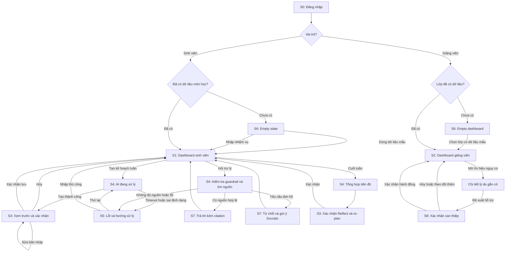

# X-Tutor — Wireframe / UI Flow

**Mã đề:** EDU-01 | **Đội:** P-008 | **Phạm vi:** MVP Gate 01 | **Cập nhật:** 20/09/2026

> Wireframe ưu tiên đủ trạng thái và đúng luồng, chưa thể hiện thiết kế hình ảnh cuối cùng. Phạm vi bám theo `01-brief.md` và các user story P0 trong `02-prd.md`.

## 1. Danh sách màn hình

| ID | Màn hình | Vai trò/trạng thái | Yêu cầu được đáp ứng |
|---|---|---|---|
| S0 | Đăng nhập/chọn vai trò | Chung | Điểm bắt đầu và phân quyền |
| S1 | Dashboard sinh viên | Sinh viên | Màn hình chính vai trò 1 |
| S2 | Dashboard giảng viên | Giảng viên | Màn hình chính vai trò 2 |
| S3 | Xác nhận kế hoạch AI | Sinh viên, HITL | Xác nhận trước khi ghi dữ liệu |
| S4 | AI đang xử lý | Loading | Không để người dùng tưởng ứng dụng treo |
| S5 | Không thể trả lời/lỗi | Error | Nêu giới hạn và hướng xử lý tiếp theo |
| S6 | Chưa có dữ liệu | Empty | Trạng thái người dùng mới |
| S7 | Câu trả lời có nguồn/guardrail | Sinh viên | Kết quả grounded hoặc chuyển hướng an toàn |
| S8 | Xác nhận can thiệp | Giảng viên, HITL | Không tự gửi liên hệ hoặc áp dụng hành động |

## 2. UI Flow tổng thể



## 3. Wireframes

### S0 — Đăng nhập và chọn vai trò

```text
┌──────────────────────────────────────────────────────────────┐
│ X-Tutor                                                      │
│ Trợ lý học tập Plan – Do – Reflect                           │
├──────────────────────────────────────────────────────────────┤
│ Email                                                        │
│ [ sinhvien@example.edu                              ]         │
│ Mật khẩu                                                     │
│ [ •••••••••••                                       ]         │
│                                                              │
│ Vai trò                                                      │
│ (●) Sinh viên              ( ) Giảng viên/Cố vấn             │
│                                                              │
│                         [ Đăng nhập ]                         │
│                                                              │
│ Bản demo chỉ sử dụng dữ liệu mô phỏng hoặc đã ẩn danh.       │
└──────────────────────────────────────────────────────────────┘
```

Điều kiện chuyển: đăng nhập thành công → kiểm tra quyền và dữ liệu của đúng vai trò; lỗi xác thực → ở lại S0 và hiện thông báo cạnh trường lỗi.

### S1 — Dashboard sinh viên

```text
┌──────────────────────────────────────────────────────────────────────────┐
│ X-Tutor      Tổng quan | Kế hoạch | Hỏi đáp | Reflect       [Sinh viên] │
├──────────────────────────────────────────────────────────────────────────┤
│ Chào Minh — Tuần 20/09–26/09                 Tiến độ tuần: 6/9 (67%)    │
│                                                                          │
│ VIỆC NÊN LÀM TIẾP                         DEADLINE GẦN                    │
│ ┌─────────────────────────────────────┐   ┌────────────────────────────┐ │
│ │ [ ] Viết dàn ý báo cáo      45 phút│   │ 22/09  Quiz môn A          │ │
│ │ [>] Ôn chương 3             60 phút│   │ 24/09  Báo cáo môn B       │ │
│ │ [✓] Đọc rubric              20 phút│   │ 26/09  Assignment môn C    │ │
│ └─────────────────────────────────────┘   └────────────────────────────┘ │
│                                                                          │
│ [ + Tạo kế hoạch tuần ]  [ Hỏi trợ lý có nguồn ]  [ Reflect cuối tuần ]│
│                                                                          │
│ Nguồn dữ liệu: Canvas mock • cập nhật 09:30 20/09/2026                  │
└──────────────────────────────────────────────────────────────────────────┘
```

Hành động chính: tạo/sửa kế hoạch, cập nhật `todo → in_progress → done`, mở hỏi đáp hoặc bắt đầu Reflect.

### S2 — Dashboard giảng viên

```text
┌──────────────────────────────────────────────────────────────────────────┐
│ X-Tutor          Tổng quan lớp | Tín hiệu | Tài liệu       [Giảng viên] │
├──────────────────────────────────────────────────────────────────────────┤
│ Lớp: CS101                 Dữ liệu tổng hợp, không hiển thị chat riêng   │
│                                                                          │
│ Hoàn thành kế hoạch: 72%  │ Có nguy cơ trễ: 5 │ Đã Reflect: 68%          │
│                                                                          │
│ TÍN HIỆU CẦN XEM                          ĐIỂM NGHẼN CHUNG               │
│ ┌────────────────────────────────────┐   ┌─────────────────────────────┐ │
│ │ Nhóm ẩn danh A • deadline < 48h   │   │ 1. Dynamic Programming     │ │
│ │ Lý do: chưa bắt đầu milestone     │   │ 2. Cách đọc rubric         │ │
│ │ [ Xem lý do gắn cờ ]              │   │ 3. Trích dẫn học thuật     │ │
│ └────────────────────────────────────┘   └─────────────────────────────┘ │
│                                                                          │
│ Cảnh báo: AI chỉ đề xuất tín hiệu; giảng viên quyết định can thiệp.      │
└──────────────────────────────────────────────────────────────────────────┘
```

Quyền riêng tư: P0 chỉ hiển thị dữ liệu tổng hợp/ẩn danh; không hiển thị nội dung chat hoặc tự giải ẩn danh sinh viên.

### S3 — Xác nhận kế hoạch AI (Human-in-the-loop)

```text
┌──────────────────────────────────────────────────────────────┐
│ Xem trước kế hoạch tuần                         [Bản nháp AI]│
├──────────────────────────────────────────────────────────────┤
│ Nguồn: Assignment 2 • Rubric môn CS101 • hạn 26/09          │
│                                                              │
│ 1. Đọc đề và rubric                [30 phút] [20/09 19:00]   │
│ 2. Lập dàn ý                       [45 phút] [21/09 19:00]   │
│ 3. Viết bản nháp                  [120 phút] [23/09 18:00]   │
│ 4. Kiểm tra và hoàn thiện          [60 phút] [25/09 18:00]   │
│                                                              │
│ [ Sửa nhiệm vụ ] [ Sửa thời lượng ] [ Sửa lịch ]             │
│                                                              │
│ AI có thể ước lượng sai. Kế hoạch chỉ được lưu khi bạn       │
│ xác nhận.                                                    │
│                                                              │
│ [ Hủy ]                         [ Xác nhận và lưu kế hoạch ]  │
└──────────────────────────────────────────────────────────────┘
```

Điều kiện chuyển: **Xác nhận** → ghi DB và quay lại S1; **Hủy** → không ghi; **Sửa** → cập nhật bản nháp rồi yêu cầu xác nhận lại.

### S4 — Agent đang xử lý

```text
┌──────────────────────────────────────────────────────────────┐
│ X-Tutor đang chuẩn bị câu trả lời…                           │
├──────────────────────────────────────────────────────────────┤
│ ✓ Kiểm tra yêu cầu và liêm chính học thuật                   │
│ ● Tìm nội dung liên quan trong tài liệu môn học              │
│ ○ Kiểm tra nguồn trích dẫn                                   │
│ ○ Soạn câu trả lời                                           │
│                                                              │
│ Có thể mất 5–20 giây. Bạn có thể hủy mà không mất dữ liệu.   │
│                                              [ Hủy xử lý ]    │
└──────────────────────────────────────────────────────────────┘
```

Yêu cầu UX: có trạng thái từng bước, thông báo thời gian dự kiến và nút hủy; không ghi thay đổi dở dang.

### S5 — Lỗi hoặc không thể trả lời

```text
┌──────────────────────────────────────────────────────────────┐
│ Không thể tạo câu trả lời có thể kiểm chứng                  │
├──────────────────────────────────────────────────────────────┤
│ X-Tutor chưa tìm thấy đủ thông tin trong tài liệu của môn    │
│ CS101. Hệ thống sẽ không đoán hoặc tạo nguồn không tồn tại.  │
│                                                              │
│ Bạn có thể:                                                  │
│ • Chọn lại đúng môn học.                                     │
│ • Viết lại câu hỏi cụ thể hơn.                               │
│ • Liên hệ giảng viên nếu tài liệu chưa được cung cấp.        │
│                                                              │
│ [ Quay lại ]          [ Thử lại ]          [ Nhập thủ công ] │
│                                                              │
│ Mã lỗi: NO_GROUNDED_CONTEXT • dữ liệu chưa bị thay đổi       │
└──────────────────────────────────────────────────────────────┘
```

Biến thể cùng bố cục: `LLM_TIMEOUT`, `QUOTA_EXCEEDED`, `INVALID_AI_OUTPUT`, `CANVAS_SYNC_FAILED`, `SAVE_FAILED`.

### S6 — Trạng thái rỗng

```text
┌──────────────────────────────────────────────────────────────┐
│ Chưa có môn học hoặc nhiệm vụ                                │
├──────────────────────────────────────────────────────────────┤
│ X-Tutor cần assignment và deadline để tạo kế hoạch tuần.     │
│                                                              │
│ [ Dùng dữ liệu mẫu ]                                         │
│ [ Nhập nhiệm vụ thủ công ]                                   │
│ [ Kết nối Canvas read-only — nếu được bật ]                  │
│                                                              │
│ X-Tutor không tự nộp bài hoặc thay đổi dữ liệu trên Canvas.  │
└──────────────────────────────────────────────────────────────┘
```

Empty state giảng viên dùng cùng nguyên tắc: “Chưa đủ dữ liệu lớp để tổng hợp”, kèm lựa chọn lớp demo hoặc quay lại.

### S7 — Kết quả có nguồn và guardrail

```text
┌──────────────────────────────────────────────────────────────┐
│ Trợ lý học tập có nguồn                                      │
├──────────────────────────────────────────────────────────────┤
│ Bạn hỏi: “Rubric yêu cầu phần phân tích gồm những gì?”       │
│                                                              │
│ Trả lời: Rubric yêu cầu nêu giả định, phương pháp và giải    │
│ thích kết quả.                                               │
│ Nguồn: [CS101_Assignment2_Rubric.pdf • trang 2]              │
│                                                              │
│ [ Mở nguồn ] [ Hỏi tiếp ]                                    │
├──────────────────────────────────────────────────────────────┤
│ Nếu yêu cầu làm hộ:                                          │
│ “Mình không thể viết đáp án để bạn nộp. Mình có thể giúp     │
│ bạn xác định bước đầu tiên hoặc kiểm tra dàn ý của bạn.”     │
│ [ Gợi ý bước đầu ] [ Giải thích khái niệm ]                  │
└──────────────────────────────────────────────────────────────┘
```

### S8 — Giảng viên xác nhận can thiệp (Human-in-the-loop)

```text
┌──────────────────────────────────────────────────────────────┐
│ Xác nhận biện pháp hỗ trợ                                    │
├──────────────────────────────────────────────────────────────┤
│ Tín hiệu: nhóm ẩn danh A chưa bắt đầu milestone, deadline    │
│ còn dưới 48 giờ. Dữ liệu cập nhật: 09:30 20/09/2026.         │
│                                                              │
│ Hành động đề xuất: đăng thông báo nhắc chung cho lớp.        │
│ Nội dung xem trước:                                          │
│ [ Hãy kiểm tra kế hoạch Assignment 2 trước ngày 22/09… ]     │
│                                                              │
│ Không có thông báo nào được gửi nếu chưa xác nhận.           │
│                                                              │
│ [ Hủy ] [ Theo dõi thêm ]          [ Xác nhận hành động ]    │
└──────────────────────────────────────────────────────────────┘
```

## 4. Quy tắc trạng thái dùng khi code

| State | Khi nào xuất hiện | Hành động người dùng luôn phải có |
|---|---|---|
| `empty` | Không có course/assignment hoặc chưa đủ dữ liệu lớp | Dùng dữ liệu mẫu, nhập thủ công hoặc quay lại |
| `loading` | Agent/RAG đang chạy | Hủy xử lý; không mất dữ liệu |
| `success` | Có kết quả hợp lệ | Xem nguồn, sửa/xác nhận hoặc tiếp tục |
| `blocked` | Guardrail phát hiện yêu cầu làm hộ | Xem lý do và chọn hỗ trợ Socratic |
| `error` | Timeout, quota, sai schema, mất kết nối hoặc lỗi lưu | Thử lại, quay lại hoặc dùng cách thủ công |
| `confirm` | Trước hành động ghi/xóa/gửi/can thiệp | Xem trước đầy đủ, xác nhận hoặc hủy |

## 5. Checklist Gate 01

- [x] Có màn hình chính sinh viên.
- [x] Có màn hình chính giảng viên/cố vấn.
- [x] Có màn hình xác nhận cho kế hoạch AI và can thiệp của giảng viên.
- [x] Có trạng thái agent đang xử lý.
- [x] Có trạng thái lỗi/không đủ nguồn và hành động phục hồi.
- [x] Có trạng thái rỗng cho người dùng mới.
- [x] Có UI Flow Mermaid với điều kiện chuyển màn hình.
- [x] Có giới hạn sản phẩm và guardrail hiển thị rõ cho người dùng.
