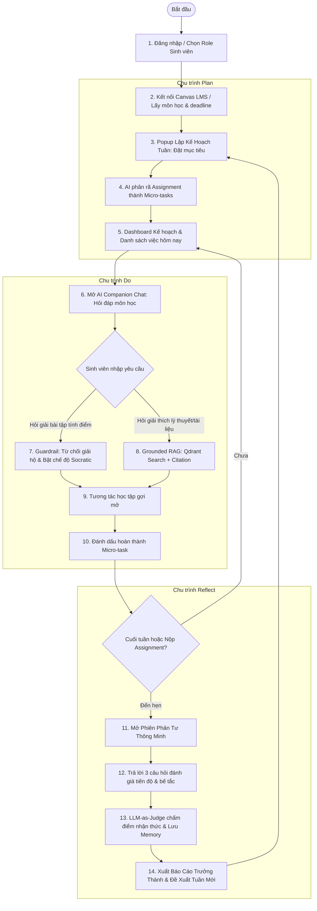

# WIREFRAME & UI FLOW SPECIFICATION
## Trợ Lý Học Tập Cá Nhân AI (Study Companion - EDU-01)
**Mã đề tài:** EDU-01 | **Mục tiêu:** Thiết kế trải nghiệm người dùng hoàn chỉnh cho chu trình Plan - Do - Reflect

---

## 1. Bản đồ luồng người dùng (User Flow Diagrams)

### 1.1 Luồng sinh viên (Student Experience Flow)



### 1.2 Luồng giảng viên (Instructor Dashboard Flow)

```mermaid
flowchart TD
    InstStart([Giảng viên đăng nhập]) --> InstDash[1. Dashboard Tổng quan Môn học]
    InstDash --> ViewMetrics[2. Thống kê tỷ lệ nộp bài đúng hạn: Trước vs Sau khi dùng AI]
    InstDash --> ViewConfusion[3. Bản đồ nhiệt các chủ đề sinh viên hỏi nhiều nhất]
    InstDash --> ViewRiskAlerts[4. Danh sách nhóm SV có nguy cơ trễ hạn (Ẩn danh FERPA)]
    ViewRiskAlerts --> SendEncouragement[5. Gửi thông điệp khích lệ / Mở thêm office hours]
    InstDash --> UploadMaterials[6. Quản lý tài liệu Syllabus & Slides cập nhật vào Qdrant]
```

---

## 2. Thiết kế giao diện chi tiết (Screen-by-Screen Wireframes)

### Màn hình 1: Đăng nhập & Kết nối Canvas LMS (Login & Onboarding)
Giao diện tinh gọn, hiện đại với hỗ trợ SSO Đại học và chọn vai trò:

```text
+-------------------------------------------------------------------------------+
|  Study Companion | EDU-01                                     [Theme Dark] |
+-------------------------------------------------------------------------------+
|                                                                               |
|                             [ Logo Study ]                                 |
|               TRỢ LÝ HỌC TẬP ĐỒNG HÀNH PLAN - DO - REFLECT                   |
|                                                                               |
|               +---------------------------------------------+                 |
|               |  Vui lòng chọn vai trò để tiếp tục:         |                 |
|               |                                             |                 |
|               |  (•) Sinh viên (Student)                    |                 |
|               |  ( ) Giảng viên (Instructor)                |                 |
|               |                                             |                 |
|               |  [ Đăng nhập với VinUni Google SSO ]        |                 |
|               |                                             |                 |
|               |  -- HOẶC KẾT NỐI TÀI KHOẢN CANVAS LMS --   |                 |
|               |  Canvas API Token / LTI 1.3:                |                 |
|               |  [ ••••••••••••••••••••••••••••••••• ]      |                 |
|               |  [x] Dùng dữ liệu Sandbox mẫu (Demo Mode)   |                 |
|               |                                             |                 |
|               |  [ Tiếp tục vào Không Gian Học Tập -> ]     |                 |
|               +---------------------------------------------+                 |
|                                                                               |
+-------------------------------------------------------------------------------+
```

---

### Màn hình 2: Bảng điều khiển Sinh viên - Giai đoạn PLAN (Student Plan Dashboard)
Hiển thị lịch tuần, mục tiêu tuần, danh sách bài tập Canvas và tính năng AI phân rã việc:

```text
+-------------------------------------------------------------------------------+
| [Study]  Môn: [ CS301 - Thuật toán v ]        Tuần 5: 16/09 - 22/09  [User] |
+-------------------------------------------------------------------------------+
| [Tab: Lập Kế Hoạch (Plan)] | [Tab: Trợ Lý Học Tập (Do)] | [Tab: Phản Tư (Reflect)]|
+--------------------------------------+----------------------------------------+
| 🎯 MỤC TIÊU TUẦN CỦA BẠN             | 📅 DEADLINE CANVAS ĐỒNG BỘ             |
| 1. [x] Nắm vững Quy hoạch động (DP)  | • Assignment 2: Dynamic Programming    |
| 2. [ ] Hoàn thành Lab 3 trước thứ Sáu|   Hạn chót: 23:59 Thứ Sáu (Còn 2 ngày) |
| 3. [ ] Đọc tài liệu tuần 6 môn AI    | • Quiz 4: Greedy Algorithms            |
|                                      |   Hạn chót: 12:00 Chủ Nhật             |
| [+ Đặt thêm mục tiêu mới]            |                                        |
+--------------------------------------+----------------------------------------+
| 🤖 AI PHÂN RÃ NHIỆM VỤ THÔNG MINH (Task Breakdown by AI)                     |
| Môn học: CS301 - Assignment 2 (Độ khó: Cao | Dự kiến: 8 giờ học)             |
| [ Nút: AI Chia Nhỏ Lại Nhiệm Vụ ]                                            |
|                                                                               |
| [x] Bước 1: Đọc Syllabus & Slide Lecture 8 (Trang 1-25) [2h]     [Nguồn: L8] |
| [ ] Bước 2: Viết mã nguồn bài toán Knapsack 0/1 [2.5h]          [Hôm nay]    |
| [ ] Bước 3: Viết Unit Test & Đo độ phức tạp thời gian [1.5h]    [Ngày mai]   |
| [ ] Bước 4: Viết Report theo Rubric Canvas [2h]                 [Thứ Năm]    |
|                                                                               |
| Tiến độ tuần này: [████████████░░░░░░░░] 60% hoàn thành                     |
+-------------------------------------------------------------------------------+
```

---

### Màn hình 3: Giao diện Trợ lý DO - Hỏi đáp học thuật & Guardrails
Giao diện Socratic Chatbot với thanh trích nguồn tài liệu học tập (Grounded RAG) và thanh cảnh báo liêm chính học thuật:

```text
+-------------------------------------------------------------------------------+
| [Study Companion] - Chế độ: DO (Đồng Hành Học Tập)          [Môn: CS301]   |
+----------------------------------+--------------------------------------------+
| 📑 TÀI LIỆU CHÍNH QUY (RAG)      | 💬 ĐỐI THOẠI HỌC TẬP SOCRATIC              |
|                                  |                                            |
| • Slide_Lecture_08_DP.pdf        | [Sinh viên]: Hãy viết code giải hoàn chỉnh |
|   (Trích dẫn: Slide 14)          | bài tập Knapsack Assignment 2 cho tôi.     |
| • Textbook_Cormen_Ch15.pdf       |                                            |
|   (Trích dẫn: Trang 384)         | 🛡️ [AI GUARDRAIL - LIÊM CHÍNH HỌC THUẬT]:   |
| • Assignment2_Rubric.pdf         | "Study không thể giải hộ bài tập tính   |
|                                  | điểm của bạn nhằm đảm bảo quy chế đại học. |
|                                  | Tuy nhiên, mình sẽ hướng dẫn bạn phương    |
| 📌 TIẾN ĐỘ MICRO-TASK            | pháp tiếp cận từng bước!"                  |
| [x] Đọc đề bài                   |                                            |
| [ ] Lập công thức truy hồi       | 🤖 [AI Companion - Socratic Guide]:        |
| [ ] Viết code cài đặt            | "Để giải bài toán Knapsack 0/1, bạn hãy    |
| [ ] Nộp bài Canvas               | xem xét 2 trạng thái tại mỗi đồ vật i:     |
|                                  | 1. Ta chọn đồ vật i (sức chứa giảm w[i])   |
|                                  | 2. Ta không chọn đồ vật i                  |
|                                  |                                            |
|                                  | Bạn có thể viết công thức truy hồi cho     |
|                                  | max value V(i, W) từ 2 trường hợp này?"    |
|                                  | 📖 [Nguồn tham khảo: Slide 8, tr. 14]      |
|                                  |                                            |
|                                  +--------------------------------------------+
|                                  | [Nhập câu trả lời hoặc câu hỏi...]   [Gửi] |
+----------------------------------+--------------------------------------------+
```

---

### Màn hình 4: Giao diện REFLECT - Phiên phản tư cuối tuần (Weekly Reflection)
Phiên tự đánh giá siêu nhận thức, chấm điểm nhận thức bằng LLM-as-Judge:

```text
+-------------------------------------------------------------------------------+
| 🪞 PHIÊN PHẢN TƯ HỌC TẬP CUỐI TUẦN (WEEKLY REFLECTION) - TUẦN 5               |
+-------------------------------------------------------------------------------+
| Kính gửi Minh, bạn đã hoàn thành 80% mục tiêu tuần và nộp Assignment 2 đúng hạn!|
| Hãy dành 3 phút đối thoại phản tư để tối ưu hóa năng suất tuần 6:              |
|                                                                               |
| Câu hỏi 1: Ở Assignment 2, khâu nào khiến bạn tốn nhiều thời gian nhất?       |
| [Sinh viên]: Tôi bị kẹt ở khâu gỡ lỗi mảng 2 chiều và mất gần 3 tiếng.         |
|                                                                               |
| Câu hỏi 2: Bạn đã dùng phương pháp nào để vượt qua điểm nghẽn đó?             |
| [Sinh viên]: Tôi vẽ bảng trạng thái ra giấy theo gợi ý của AI rồi mới code.  |
|                                                                               |
| Câu hỏi 3: Bạn rút ra bài học gì cho đợt làm Assignment 3 sắp tới?            |
| [Sinh viên]: Cần phác thảo thuật toán và test case nhỏ ra giấy trước khi code.|
|                                                                               |
| ----------------------------------------------------------------------------- |
| 📊 PHÂN TÍCH NHẬN THỨC CỦA AI (Metacognitive Score: 9.2/10)                  |
| ⭐ Điểm mạnh ghi nhận: Kỹ năng trực quan hóa bài toán và kiên trì gỡ lỗi.      |
| 💡 Khuyến nghị tuần tới: Bắt đầu vẽ flow chart từ ngày thứ Ba thay vì thứ Năm.|
| 💾 [Đã lưu vào Bộ nhớ học tập cá nhân để nhắc nhở tuần sau]                  |
|                                                                               |
| [ Hoàn Tất Phản Tư & Sang Tuần Mới -> ]                                       |
+-------------------------------------------------------------------------------+
```

---

### Màn hình 5: Bảng điều khiển Giảng viên - Dữ liệu ẩn danh FERPA (Instructor Dashboard)
Bảo mật thông tin sinh viên, trực quan hóa nhịp độ lớp học và cảnh báo rủi ro trễ hạn:

```text
+-------------------------------------------------------------------------------+
| [Study Portal] - BẢNG ĐIỀU KHIỂN GIẢNG VIÊN | Môn: CS301 Thuật toán       |
+-------------------------------------------------------------------------------+
| 📈 CHỈ SỐ TOÀN DIỆN MÔN HỌC (Tổng số: 120 Sinh viên | FERPA Anonymized)        |
|                                                                               |
| [ Tỷ Lệ Nộp Đúng Hạn ]      [ Tiến Độ Kế Hoạch ]     [ Điểm Phản Tư TB ]      |
|     89.2% (Tăng +18%)           76% hoàn thành            8.4 / 10            |
| (So với 71% trước khi dùng)   các micro-milestones    Mức độ tự giác: Tốt     |
+-------------------------------------------------------------------------------+
| 🔥 BẢN ĐỒ NHIỆT ĐIỂM NGHẼN KIẾN THỨC (Concept Confusion Heatmap)             |
| 1. Dynamic Programming (Memoization):  ███████████████████ 64 câu hỏi         |
| 2. Graph Traversal (DFS/BFS):          ████████ 28 câu hỏi                    |
| 3. Amortized Analysis:                 ████ 14 câu hỏi                        |
| -> Gợi ý Giảng viên: Dành 15 phút đầu giờ buổi tới để giải thích lại memo table|
+-------------------------------------------------------------------------------+
| ⚠️ CẢNH BÁO NGUY CƠ TRỄ HẠN (Early At-Risk Alerts - Anonymized Group)         |
| • Nhóm Rủi Ro A (8 sinh viên): Chưa bắt đầu Micro-task nào cho Lab 4 (<24h)   |
| • Nhóm Rủi Ro B (5 sinh viên): Bỏ lỡ 2 phiên phản tư tuần liên tiếp           |
|                                                                               |
| [ Gửi Thông Báo Khích Lệ Tự Động ]    [ Xuất Báo Cáo Phân Tích (.CSV) ]      |
+-------------------------------------------------------------------------------+
```
