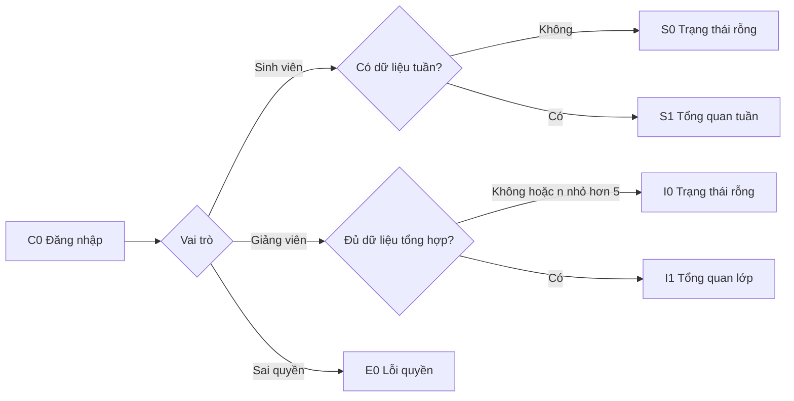
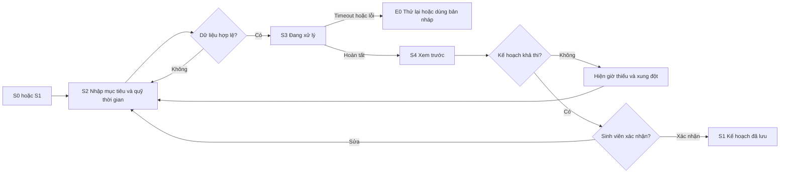
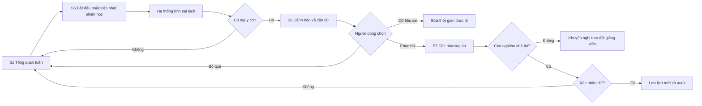
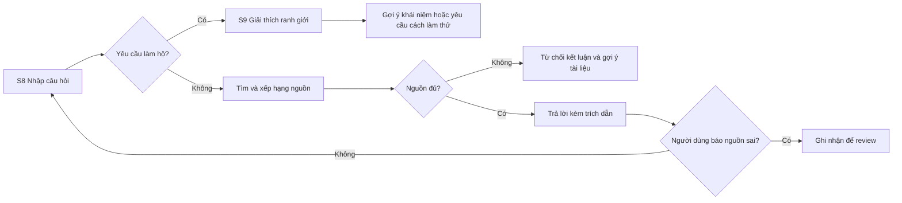
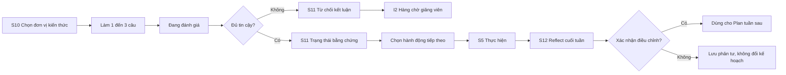
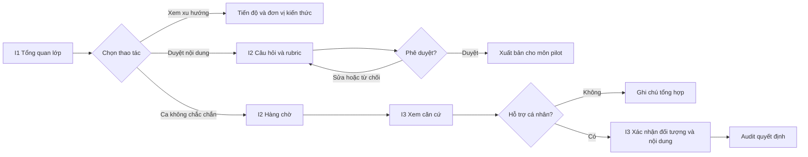

# PaceWise — Wireframe / UI Flow

**Phiên bản:** 1.0 · **Cập nhật:** 24/09/2026
Mục tiêu của tài liệu là khóa đủ màn hình, trạng thái và điểm xác nhận để frontend/backend có thể code cùng một hợp đồng.

## 1. Kiến trúc giao diện

PaceWise có hai bề mặt dùng chung API và phân quyền:

- **Student Experience:** Plan–Do–Reflect, hỏi đáp có nguồn, kiểm tra nhanh và phục hồi kế hoạch.
- **Management Console:** dashboard tổng hợp, duyệt câu hỏi/rubric, xử lý ca cần người xem.

MVP luôn chạy bằng Canvas fixture. Canvas REST chỉ đọc được bật khi có sandbox/token. LTI 1.3 là P1 khi có developer key.

## 2. Danh sách màn hình

| ID | Màn hình | Vai trò | Trạng thái bắt buộc |
|---|---|---|---|
| C0 | Đăng nhập/chọn vai trò | Cả hai | mặc định, sai quyền |
| S0 | Chưa có dữ liệu tuần | Sinh viên | rỗng |
| S1 | Tổng quan tuần | Sinh viên | đủ dữ liệu, dữ liệu Canvas cũ |
| S2 | Quỹ thời gian và mục tiêu | Sinh viên | hợp lệ, xung đột |
| S3 | AI đang lập kế hoạch | Sinh viên | đang xử lý, timeout |
| S4 | Xem trước/xác nhận kế hoạch | Sinh viên | khả thi, quá tải, vô nghiệm |
| S5 | Thực hiện/cập nhật tiến độ | Sinh viên | đúng tiến độ, sai lệch |
| S6 | Cảnh báo nguy cơ | Sinh viên | cảnh báo, người dùng bác bỏ |
| S7 | Xem trước/xác nhận phục hồi | Sinh viên | 2–3 phương án, vô nghiệm |
| S8 | Hỏi đáp có nguồn | Sinh viên | có nguồn, thiếu nguồn |
| S9 | Chuyển hướng yêu cầu làm hộ | Sinh viên | bị chặn, gợi ý học |
| S10 | Kiểm tra nhanh | Sinh viên | câu hỏi, nộp bài, đang chấm |
| S11 | Bằng chứng hiểu bài | Sinh viên | đủ tin cậy, từ chối kết luận |
| S12 | Reflect cuối tuần | Sinh viên | bản nháp, xác nhận |
| I0 | Dashboard giảng viên rỗng | Giảng viên | chưa đủ dữ liệu/n<5 |
| I1 | Tổng quan lớp | Giảng viên | tổng hợp, filter |
| I2 | Hàng chờ duyệt | Giảng viên | cần xem, đã xử lý |
| I3 | Xác nhận hỗ trợ | Giảng viên | xem trước, đã gửi |
| E0 | Lỗi chung | Cả hai | retry, fallback |

## 3. UI Flow tổng thể

### 3.1 Điểm vào và phân quyền



### 3.2 Plan



### 3.3 Do và Recover



### 3.4 Hỏi đáp và liêm chính



### 3.5 Kiểm tra hiểu bài và Reflect



### 3.6 Giảng viên/cố vấn



## 4. Wireframe chính

### C0 — Đăng nhập

```text
+------------------------------------------------------+
| PaceWise                                             |
| Email [________________]  Mật khẩu [______________] |
| [ Đăng nhập ]                                       |
| Dữ liệu demo: [ Sinh viên ] [ Giảng viên ]          |
|                                                      |
| Nếu sai quyền: "Bạn không có quyền mở trang này."   |
+------------------------------------------------------+
```

### S0 — Trạng thái rỗng

```text
+------------------------------------------------------+
| Tuần này chưa có dữ liệu                             |
| PaceWise cần nhiệm vụ, deadline và quỹ thời gian.    |
| [ Dùng dữ liệu Canvas mô phỏng ] [ Đồng bộ lại ]    |
| Canvas REST: Chưa kết nối                            |
| LTI: Chưa bật trong MVP                              |
+------------------------------------------------------+
```

### S1 — Tổng quan tuần

```text
+------------------------------------------------------+
| 23–29/09        Dữ liệu Canvas: 09:10 hôm nay        |
| Tiến độ 62% | 2 nguy cơ | 6 giờ còn trống           |
|------------------------------------------------------|
| Tiếp theo: Ôn khái niệm A — 45 phút                  |
| Lý do: cần trước milestone B, hạn trong 2 ngày       |
| [ Bắt đầu ] [ Cập nhật thực tế ] [ Hỏi tài liệu ]   |
|------------------------------------------------------|
| Deadline quan trọng: Assignment 2 — 27/09            |
| Cảnh báo: kế hoạch sẽ thiếu 1,5 giờ nếu giữ nhịp này |
| [ Xem phương án phục hồi ]                           |
+------------------------------------------------------+
```

Nếu dữ liệu cũ, banner phải ghi rõ thời điểm snapshot và nút đồng bộ lại.

### S2/S3 — Nhập quỹ thời gian và đang xử lý

```text
+------------------------------------------------------+
| Mục tiêu tuần [_______________________________]      |
| Thứ 2 [18:00–20:00]  Thứ 3 [không rảnh]            |
| Ràng buộc [không học sau 23:00_______________]      |
| [ Tạo kế hoạch ]                                    |
|------------------------------------------------------|
| Đang chia nhiệm vụ và kiểm tra deadline...           |
| Bước 2/3: kiểm tra xung đột lịch                     |
| [ Hủy ]   Quá 30 giây hệ thống sẽ dừng an toàn      |
+------------------------------------------------------+
```

### S4 — Xác nhận kế hoạch

```text
+------------------------------------------------------+
| Bản xem trước — chưa lưu                             |
| T2 18:00  Milestone A  60 phút  [nguồn: Assignment] |
| T4 19:00  Ôn đơn vị B 45 phút   [vì check chưa chắc]|
| T6 09:00  Hoàn thiện   90 phút                       |
|------------------------------------------------------|
| Tổng 4,5/6 giờ | Không xung đột | Slack: 8 giờ      |
| Giả định: thời lượng Assignment 2 là 3 giờ           |
| [ Sửa ] [ Hủy ] [ Xác nhận và lưu ]                 |
+------------------------------------------------------+
```

Trường hợp vô nghiệm thay bảng bằng số giờ thiếu, deadline xung đột và hành động đề xuất; không có nút “lưu”.

### S5/S6/S7 — Theo dõi, cảnh báo và phục hồi

```text
+------------------------------------------------------+
| Cảnh báo nguy cơ                                     |
| Milestone A: dự kiến 60', thực tế 105'               |
| Assignment 2 còn 1 ngày 8 giờ; slack còn 20 phút    |
| [ Dữ liệu chưa đúng ] [ Bỏ qua ] [ Phục hồi ]       |
|------------------------------------------------------|
| Phương án A: dời ôn C, giữ Assignment 2              |
| Phương án B: chia phiên tối nay, vẫn giữ ôn C         |
| Phương án C: không còn khả thi — trao đổi giảng viên |
| [ So sánh ] [ Chọn phương án ]                       |
|------------------------------------------------------|
| Xác nhận thay đổi: T4 19:00 -> T4 20:00              |
| [ Quay lại ] [ Xác nhận cập nhật ]                   |
+------------------------------------------------------+
```

Mọi phương án phải nêu đánh đổi và diff; chỉ nút xác nhận cuối cùng mới ghi DB.

### S8/S9 — Hỏi đáp có nguồn và chuyển hướng

```text
+------------------------------------------------------+
| Hỏi tài liệu môn học                                 |
| [_______________________________________________]    |
| [ Gửi ]                                             |
|------------------------------------------------------|
| Trả lời ngắn... [1] [2]                             |
| [1] Syllabus, mục 3.2  [Mở đoạn nguồn]              |
| [2] Lecture 04, trang 7 [Mở đoạn nguồn]             |
| [ Báo nguồn sai ]                                   |
|------------------------------------------------------|
| Yêu cầu làm hộ: "Mình không thể viết đáp án nộp."   |
| Hãy gửi cách bạn đã thử; mình sẽ gợi ý bước tiếp.    |
+------------------------------------------------------+
```

### S10/S11 — Kiểm tra nhanh và kết quả

```text
+------------------------------------------------------+
| Kiểm tra nhanh — Đơn vị kiến thức A                  |
| Câu 1/3: Giải thích vì sao...                        |
| [_______________________________________________]    |
| [ Nộp câu trả lời ]                                 |
|------------------------------------------------------|
| Trạng thái: Đang hình thành  | Độ tin cậy: Trung bình|
| Bằng chứng: đúng khái niệm, thiếu bước lập luận      |
| Đây không phải điểm chính thức.                      |
| Tiếp theo: xem Lecture 04 §2 rồi thử câu tương tự    |
| [ Thêm vào kế hoạch ] [ Yêu cầu giảng viên xem ]    |
+------------------------------------------------------+
```

Nếu không đủ tin cậy: hiện “Chưa đủ bằng chứng để kết luận”, lý do và nút gửi hàng chờ; không ép ra nhãn.

### S12 — Reflect cuối tuần

```text
+------------------------------------------------------+
| Tuần của bạn                                         |
| Kế hoạch 8h | Thực tế 10,2h | 1 lần phục hồi        |
| Điều hiệu quả? [_______________________________]     |
| Điều gây lệch?  [_______________________________]    |
| Tuần sau đổi gì? [_____________________________]     |
| Gợi ý: tăng ước lượng bài đọc thêm 20%               |
| [ Lưu phản tư ] [ Xác nhận dùng cho tuần sau ]      |
+------------------------------------------------------+
```

### I0/I1/I2/I3 — Giảng viên

```text
+------------------------------------------------------+
| Môn pilot — Tuần 3                                   |
| Đúng hạn 78% | 12 ca nguy cơ | 4 ca cần xem          |
|------------------------------------------------------|
| Đơn vị A: 64% "đã thể hiện" | xu hướng +8 điểm %    |
| Đơn vị B: 31% "còn nhầm lẫn" | cần xem              |
| Chỉ hiển thị nhóm n >= 5. Không có chat thô.         |
| [ Hàng chờ 4 ] [ Duyệt câu hỏi/rubric ]             |
|------------------------------------------------------|
| Ca #PW-104 — độ tin cậy thấp                         |
| Căn cứ: 2 câu trả lời mâu thuẫn; rubric mục B2       |
| [ Không kết luận ] [ Ghi chú ] [ Chuẩn bị hỗ trợ ]  |
|------------------------------------------------------|
| Xem trước hỗ trợ: đối tượng, nội dung, căn cứ        |
| [ Hủy ] [ Xác nhận ]                                |
+------------------------------------------------------+
```

### E0 — Lỗi

```text
+------------------------------------------------------+
| Chưa thể hoàn tất tác vụ                             |
| Mã: PW-TIMEOUT | request_id: ...                     |
| Dữ liệu của bạn chưa bị thay đổi.                    |
| [ Thử lại ] [ Dùng chức năng không AI ] [ Trợ giúp ]|
+------------------------------------------------------+
```

Thông báo lỗi không lộ stack trace, secret hoặc prompt nội bộ.

## 5. Hợp đồng trạng thái

Mọi tác vụ AI phải có:

| Trạng thái | UI |
|---|---|
| idle | form/nút thao tác |
| validating | kiểm tra dữ liệu tại client/server |
| queued | đã nhận tác vụ |
| processing | tiến trình và nút hủy |
| needs_confirmation | diff, nguồn, rủi ro, nút xác nhận |
| success | kết quả và hành động tiếp |
| abstained | lý do chưa thể kết luận |
| failed | thông báo, request_id, retry/fallback |

Các action ghi dữ liệu dùng idempotency key để tránh bấm hai lần. Sau 30 giây, UI chuyển failed/timeout; không quay vô hạn.

## 6. Event tracking

| Event | Thuộc tính tối thiểu | KPI |
|---|---|---|
| plan_generated | plan_id, constraint_pass, latency | chất lượng Plan |
| plan_confirmed | plan_id, edits_count | adoption |
| task_progress_updated | planned_min, actual_min | sai số ước lượng |
| risk_detected | risk_type, lead_time | recall/precision |
| recovery_confirmed | option_id, protected_deadline | recovery success |
| citation_opened/reported | source_id, valid_after_review | grounding |
| integrity_redirected | intent, result | guardrail |
| check_completed | component_id, evidence_state, confidence | hiểu bài |
| diagnosis_reviewed | predicted, reviewer_label | macro-F1 |
| reflection_confirmed | adjustment_type | evidence-to-action |

Analytics không chứa câu trả lời/chat/phản tư thô. ID dùng mã giả.

## 7. Tiêu chí nghiệm thu UI

- Có đủ hai vai trò và tất cả màn hình rỗng, đang xử lý, lỗi, từ chối kết luận, xác nhận.
- Không ghi kế hoạch/phục hồi trước khi xác nhận.
- Mọi câu trả lời học thuật có trích dẫn hoặc nói rõ thiếu nguồn.
- Guardrail không tạo đáp án nộp được.
- Kết quả hiểu bài không trông giống điểm số.
- Dashboard ẩn dữ liệu khi n<5 và không hiển thị nội dung thô.
- Keyboard navigation, focus state, contrast và label form đạt mức dùng được.
- Responsive ở 360 px, 768 px và desktop.
- Mermaid render được trên GitHub; thuật ngữ khớp PRD.

## 8. Quy tắc nội dung và khả năng tiếp cận

- Cảnh báo luôn mô tả **dữ kiện → ảnh hưởng → lựa chọn**, không dùng câu gây áp lực như “bạn đang học kém”.
- Màu không phải tín hiệu duy nhất: mọi trạng thái có icon, nhãn chữ và mô tả ngắn.
- Nút chính dùng động từ rõ nghĩa: “Xác nhận và lưu”, “Thử lại”, “Gửi giảng viên xem”; tránh nút chung chung như “OK”.
- Trích dẫn mở đúng đoạn nguồn trong tab/panel phụ và giữ lại câu hỏi đang nhập.
- Thành phần loading thông báo tiến trình qua `aria-live`; dialog giữ focus, đóng được bằng Escape và trả focus về nút mở.
- Biểu đồ giảng viên có bảng dữ liệu tương đương cho screen reader; số liệu phần trăm luôn kèm mẫu số.
- Ngày giờ hiển thị theo múi giờ người dùng và ghi rõ khi deadline từ Canvas khác múi giờ.
- Trên mobile, thao tác xác nhận nguy cơ cao không đặt sát nút hủy; diff vẫn phải đọc được trước khi lưu.
- Empty state chỉ đưa một hành động chính. Error state không đổ lỗi người dùng và luôn cho biết dữ liệu có được lưu hay chưa.
