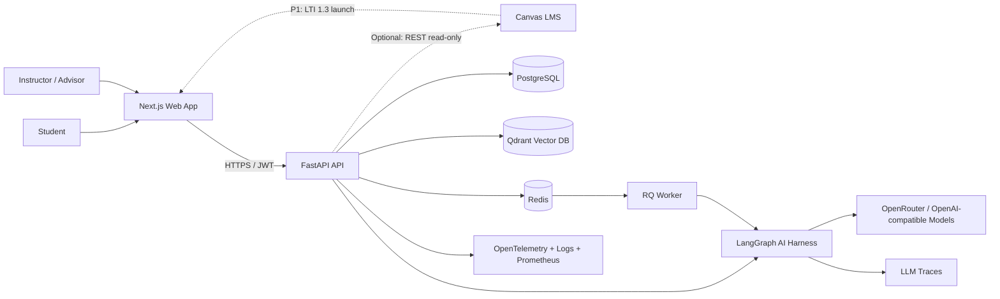
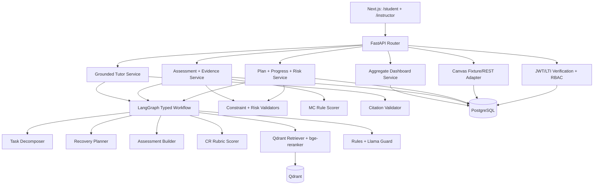
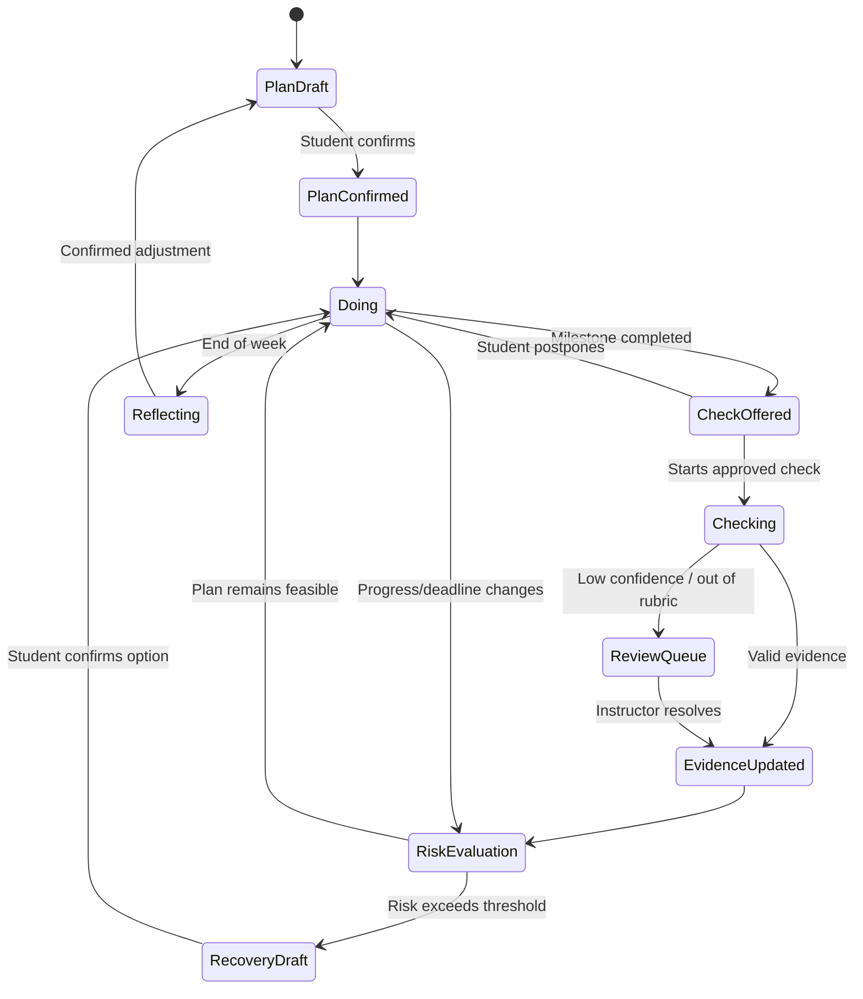
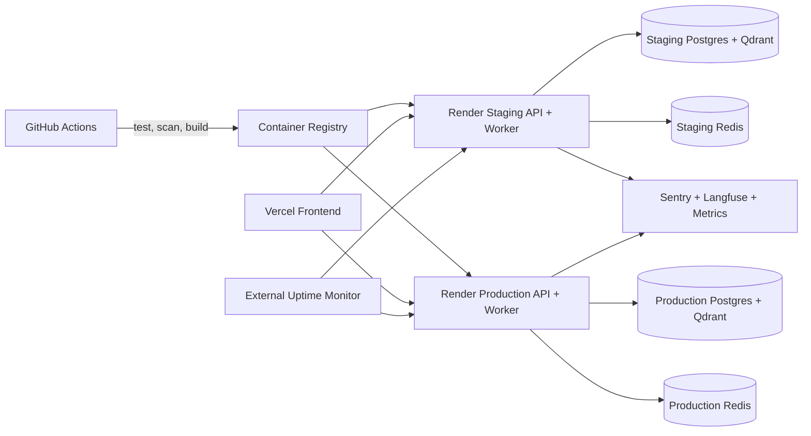

# PaceWise — Architecture

**Trạng thái:** Target architecture cho production pilot · **Cập nhật:** 24/09/2026

## 1. System context

Canvas là hệ thống bên ngoài. MVP luôn chạy bằng fixture; REST chỉ đọc chỉ bật khi có sandbox/token và LTI 1.3 là P1 khi có developer key. PaceWise không fork Canvas và không ghi điểm/nộp bài. Fixture dùng cùng schema nội bộ để CI/demo vẫn chạy khi sandbox không khả dụng.

## 2. Application components

Ranh giới quan trọng:

- LLM hiểu ngữ nghĩa và sinh đề xuất; code kiểm tra quyền, schema, deadline, key MC, citation existence và privacy threshold.
- Assessment builder không tự duyệt output của chính nó. Item/rubric phải qua quality gate và giảng viên xác nhận.
- Độ tin cậy thấp, câu trả lời ngoài rubric hoặc bộ chấm bất đồng được chuyển vào hàng chờ giảng viên; không tự cập nhật bằng chứng học tập.
- Mọi plan/re-plan, assessment publish và instructor action đều version hóa/audit.

## 3. Plan–Do–Reflect workflow

Trong sơ đồ trạng thái, `Check` và `Recovery` là các nhánh hỗ trợ bên trong bước
`Do`, không phải hai giai đoạn độc lập thay thế chu trình của đề bài.

## 4. Deployment and observability

Staging và production dùng project/schema, secret và telemetry environment tách biệt. Release gắn Git SHA, chạy Alembic migration, smoke test và có đường rollback image/migration tương thích.

## 5. Technology decisions

| Thành phần | Lựa chọn P0 | Lý do |
|---|---|---|
| Frontend | Next.js + TypeScript + Tailwind/shadcn-ui | Một codebase cho hai vai trò, responsive và test bằng Playwright |
| Backend | Python 3.11 + FastAPI + Pydantic + SQLAlchemy/Alembic | Khớp repo, API/schema rõ, migration được kiểm soát |
| Database/vector | PostgreSQL + Qdrant | Tách dữ liệu nghiệp vụ và vector; khớp stack đề bài |
| Cache/job | Redis + RQ worker | Cache/rate limit và xử lý ingestion/eval ngoài request |
| AI | LangGraph + OpenAI-compatible client/OpenRouter | Workflow có state/HITL, đổi model qua config |
| RAG | Embedding đa ngôn ngữ + Qdrant + bge-reranker | Hỗ trợ tiếng Việt và hợp đồng trích dẫn; Cohere Rerank là tùy chọn |
| Guardrail | Quy tắc xác định trước + Llama Guard | Không phụ thuộc một prompt/classifier duy nhất |
| Canvas | Fixture bắt buộc; REST read-only có điều kiện; LTI 1.3 P1 | Demo tái lập, tích hợp thật khi có credential |
| Quality | Pytest, Vitest, Playwright, Locust/k6, RAGAS + metric xác định trước | Unit, integration, E2E, load và chất lượng AI |
| Observability | OpenTelemetry, structured logs, Prometheus/Grafana, LLM tracing | Nối request → service → LLM/job, theo dõi lỗi/latency/cost |

## 6. Security and privacy boundaries

- Token Canvas, model key và DSN chỉ nằm trong secret store; không vào Git, prompt hoặc log.
- Backend kiểm tra RBAC/tenant ở service layer; frontend ẩn nút không được xem là kiểm soát quyền.
- Log dùng mã giả, loại nội dung nhạy cảm; log vận hành giữ 30 ngày và dữ liệu pilot đã thay định danh giữ 90 ngày.
- Dashboard chỉ trả aggregate khi n≥5; chat/Reflect thô không hiển thị.
- Trạng thái bằng chứng không phải điểm chính thức; không xếp hạng hay tự động kỷ luật.
- Yêu cầu xóa hoàn tất trong 30 ngày; bản sao lưu hết hạn trong 30 ngày tiếp theo.
- Backup, restore, delete/export và incident runbook phải được kiểm thử trước pilot.
