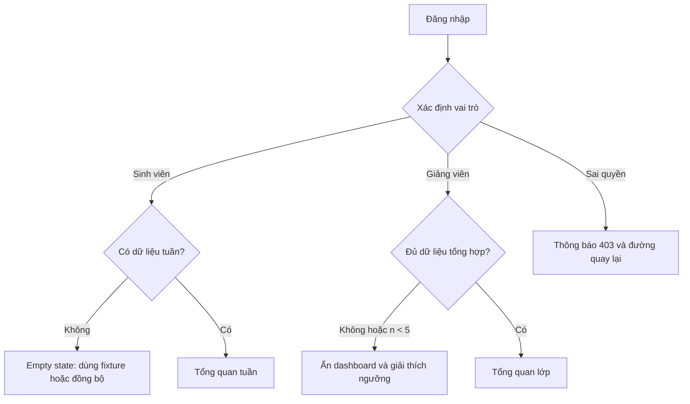
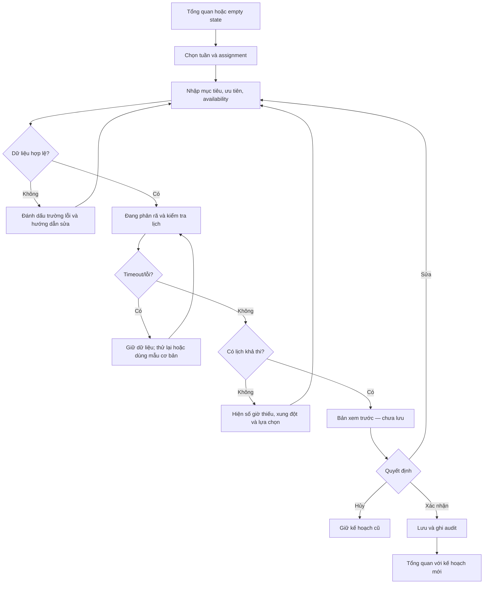
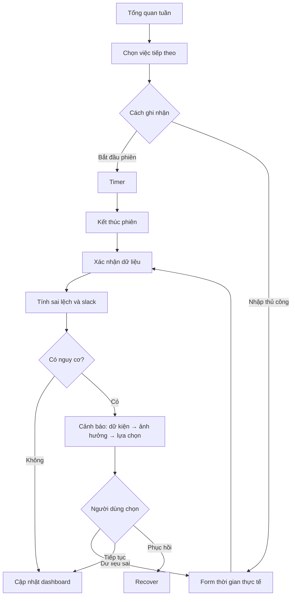
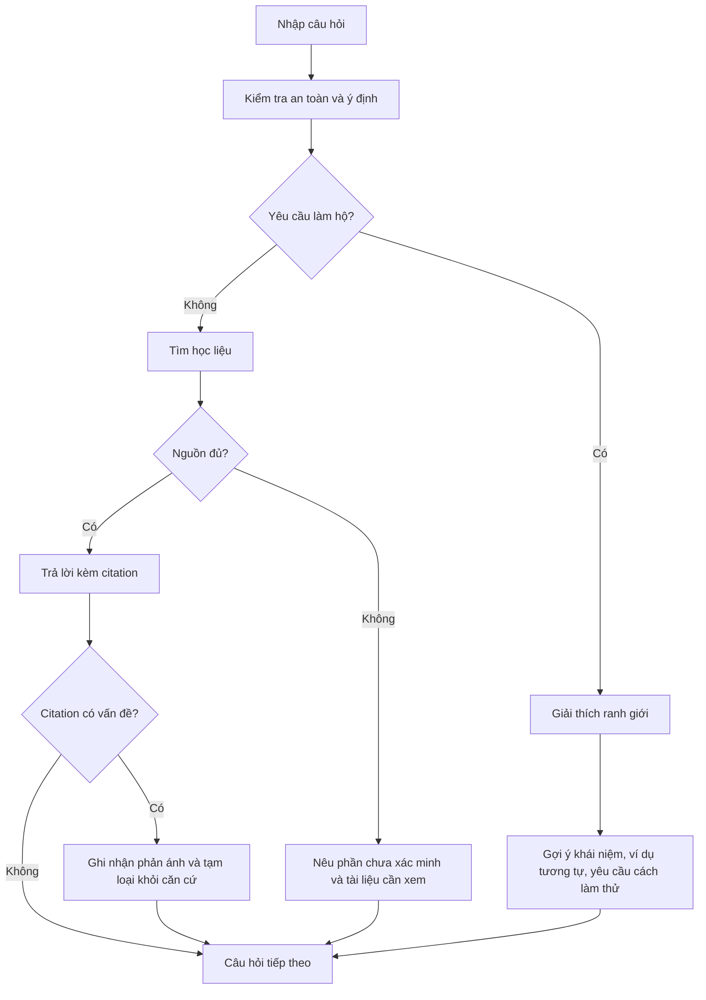
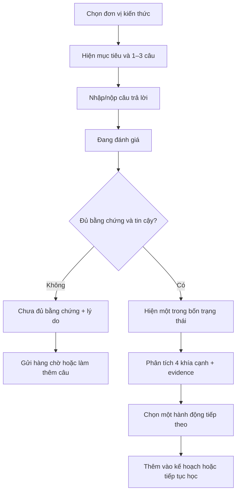
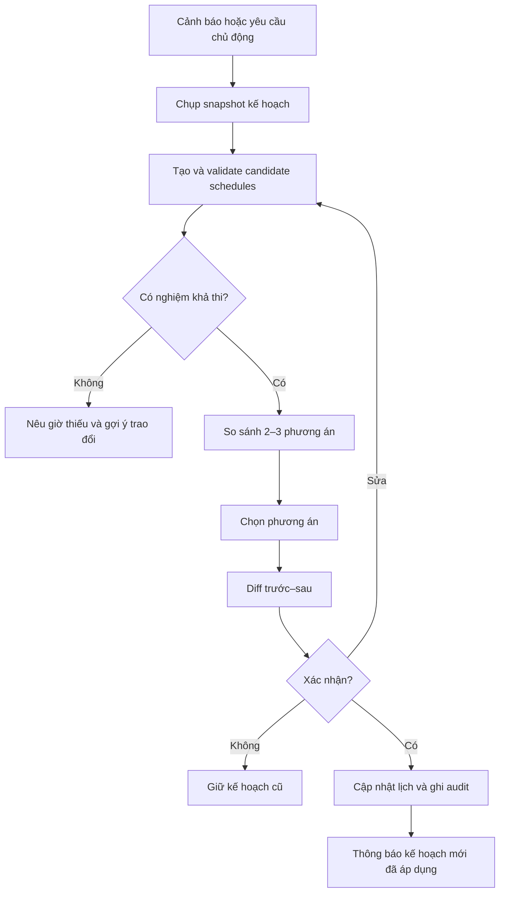
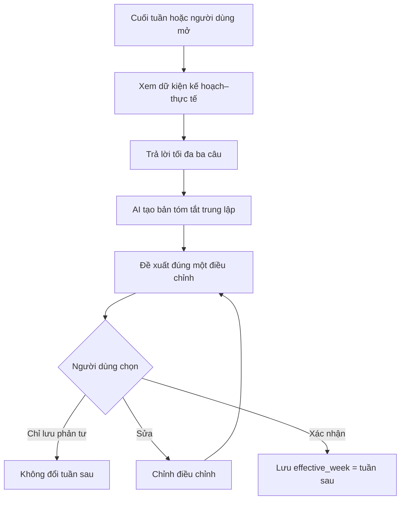
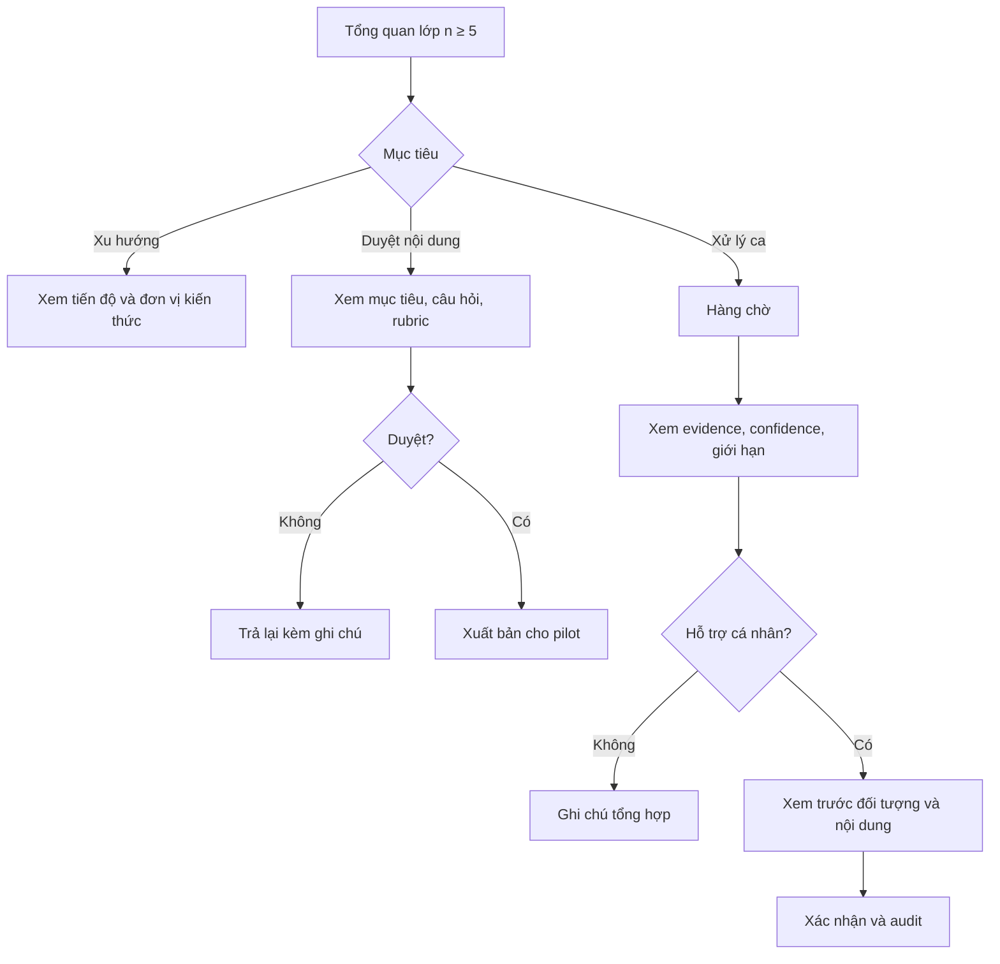
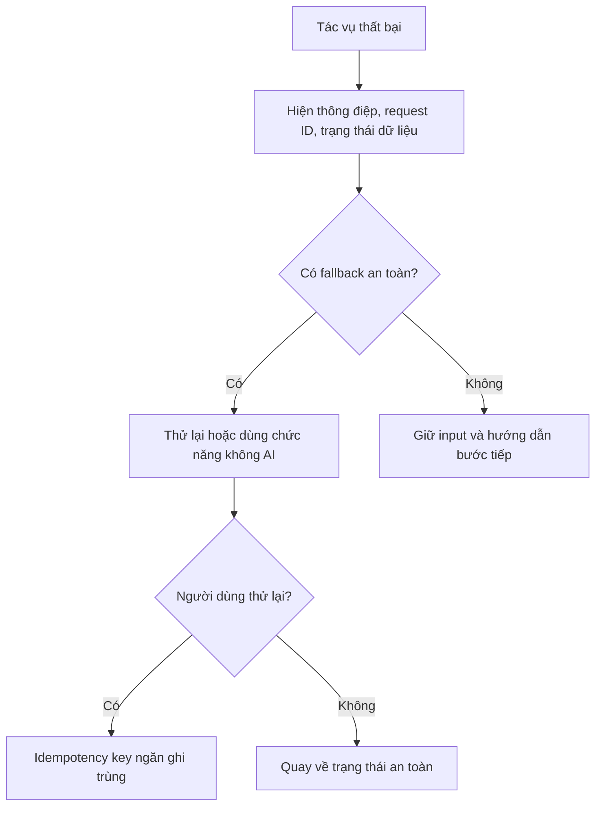

# PaceWise — User Flows

**Phiên bản:** 1.0  
**Quy ước:** mọi hành động ghi dữ liệu quan trọng đều có preview và confirmation

## 1. Luồng khởi tạo

## 2. Plan — tạo kế hoạch tuần

### Điều kiện hoàn thành

- Người dùng thấy tổng thời lượng, deadline, phụ thuộc, giả định và xung đột.
- Không lưu trước khi bấm “Xác nhận và lưu”.
- Trường hợp vô nghiệm không có nút xác nhận kế hoạch.

## 3. Do/Tracking — cập nhật tiến độ

## 4. Q&A — hỏi đáp có nguồn

## 5. Check — kiểm tra mức hiểu

## 6. Recover — phục hồi kế hoạch

### Tiêu chí so sánh cố định

1. Việc giữ lại.
2. Việc dời hoặc giảm phạm vi.
3. Thời gian thiếu/dư.
4. Deadline được bảo vệ.
5. Rủi ro còn lại.

## 7. Reflect — tổng kết tuần

## 8. Giảng viên/cố vấn

## 9. Luồng lỗi chung

